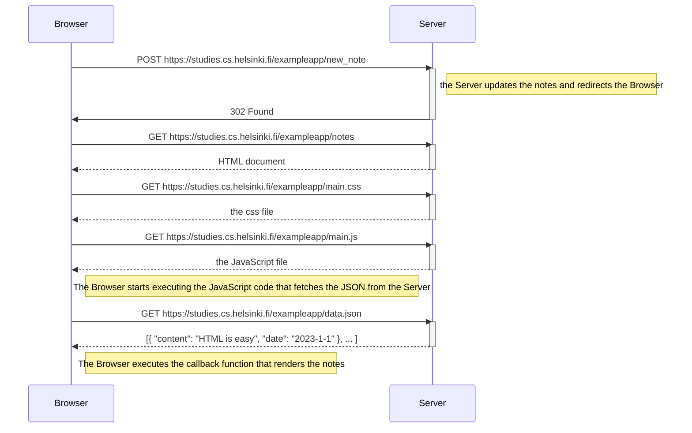

```mermaid
sequenceDiagram
    participant Browser
    participant Server
    Browser->>Server: POST https://studies.cs.helsinki.fi/exampleapp/new_note
    activate Server
    Note right of Server: the Server updates the notes and redirects the Browser
    Server->>Browser: 302 Found
    deactivate Server
    Browser->>Server: GET https://studies.cs.helsinki.fi/exampleapp/notes
    activate Server
    Server-->>Browser: HTML document
    deactivate Server

    Browser->>Server: GET https://studies.cs.helsinki.fi/exampleapp/main.css
    activate Server
    Server-->>Browser: the css file
    deactivate Server

    Browser->>Server: GET https://studies.cs.helsinki.fi/exampleapp/main.js
    activate Server
    Server-->>Browser: the JavaScript file
    deactivate Server

    Note right of Browser: The Browser starts executing the JavaScript code that fetches the JSON from the Server

    Browser->>Server: GET https://studies.cs.helsinki.fi/exampleapp/data.json
    activate Server
    Server-->>Browser: [{ "content": "HTML is easy", "date": "2023-1-1" }, ... ]
    deactivate Server

    Note right of Browser: The Browser executes the callback function that renders the notes

```