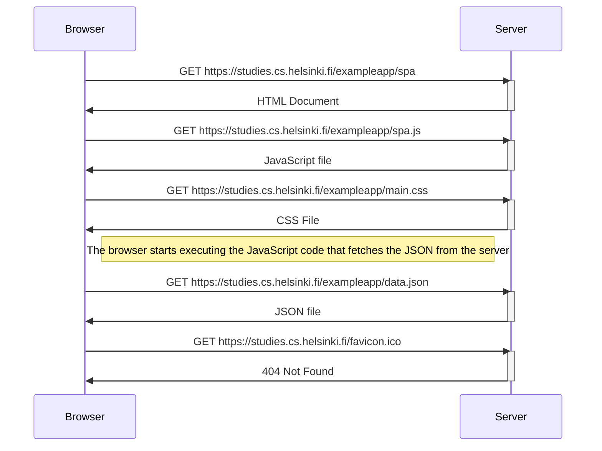

```mermaid
sequenceDiagram
    participant Browser
    participant Server
    Browser->>Server: GET https://studies.cs.helsinki.fi/exampleapp/spa
    activate Server
    Server->>Browser: HTML Document
    deactivate Server
    Browser->>Server: GET https://studies.cs.helsinki.fi/exampleapp/spa.js

    activate Server
    Server->>Browser: JavaScript file

    deactivate Server
    Browser->>Server: GET https://studies.cs.helsinki.fi/exampleapp/main.css
    activate Server
    Server->>Browser: CSS File
    deactivate Server
    Note right of Browser: The browser starts executing the JavaScript code that fetches the JSON from the server
    Browser->>Server: GET https://studies.cs.helsinki.fi/exampleapp/data.json
    activate Server
    Server->>Browser: JSON file
    deactivate Server
    Browser->>Server: GET https://studies.cs.helsinki.fi/favicon.ico
    activate Server
    Server->>Browser: 404 Not Found
    deactivate Server
```