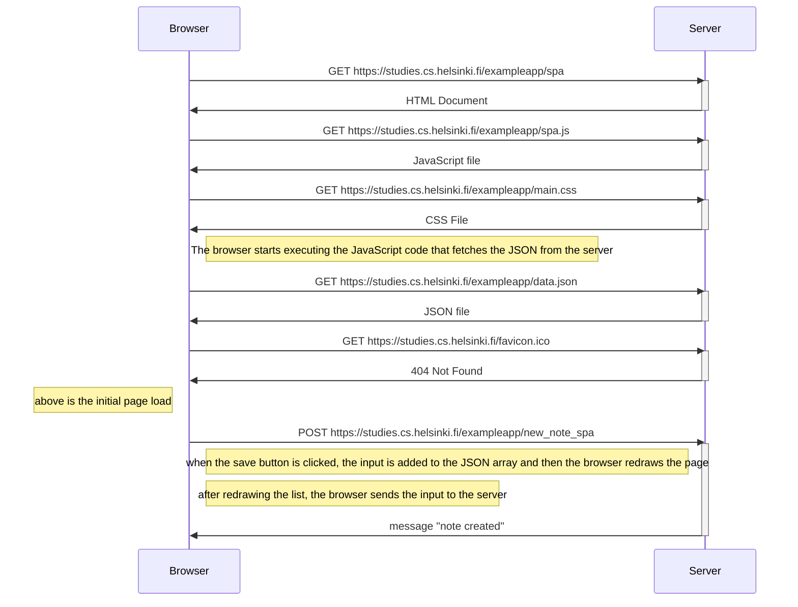

```mermaid
sequenceDiagram
    participant Browser
    participant Server
    Browser->>Server: GET https://studies.cs.helsinki.fi/exampleapp/spa
    activate Server
    Server->>Browser: HTML Document
    deactivate Server
    Browser->>Server: GET https://studies.cs.helsinki.fi/exampleapp/spa.js

    activate Server
    Server->>Browser: JavaScript file

    deactivate Server
    Browser->>Server: GET https://studies.cs.helsinki.fi/exampleapp/main.css
    activate Server
    Server->>Browser: CSS File
    deactivate Server
    Note right of Browser: The browser starts executing the JavaScript code that fetches the JSON from the server
    Browser->>Server: GET https://studies.cs.helsinki.fi/exampleapp/data.json
    activate Server
    Server->>Browser: JSON file
    deactivate Server
    Browser->>Server: GET https://studies.cs.helsinki.fi/favicon.ico
    activate Server
    Server->>Browser: 404 Not Found
    deactivate Server
    Note left of Browser: above is the initial page load
    Browser->>Server:POST https://studies.cs.helsinki.fi/exampleapp/new_note_spa
    activate Server
    Note right of Browser: when the save button is clicked, the input is added to the JSON array and then the browser redraws the page
    Note right of Browser: after redrawing the list, the browser sends the input to the server
    Server->>Browser: message "note created"
    deactivate Server
```